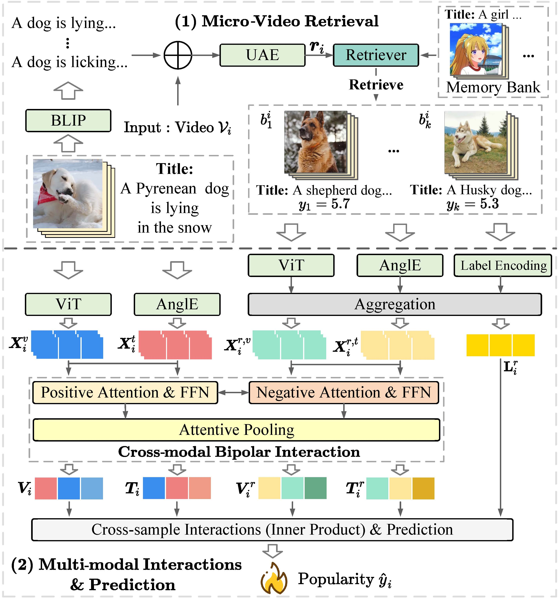

# MMRA：Predicting Micro-video Popularity via Multi-modal Retrieval Augmentation

> In this repository, we provide source code of MMRA framework for reproductivity. 🚀🚀🚀
>




## Dataset

We conducted extensive experiments on a real-world micro-video dataset.

### MicroLens

MicroLens consists of 19,738 unique micro-videos posted from 100000 users, sourced from various popular online video platforms. This is the link of the original dataset: https://github.com/westlake-repl/MicroLens


## Usage

#### Requirements

The code was tested with `python 3.8.18`, `pytorch 2.1.1`, `cudatookkit 12.1`. Install the dependencies via [Anaconda](https://www.anaconda.com/):

```shell
# create virtual environment

conda create --name MMRA python=3.8

# activate environment

conda activate MMRA

# install pytorch & cudatoolkit

pip3 install torch torchvision torchaudio --index-url https://download.pytorch.org/whl/cu121

# install other requirements

pip install pandas

pip install numpy

pip install scipy

pip install scikit-learn

pip install tqdm

pip install transformers
```

#### Run code

To train MMRA framework on a dataset, run the following command:

```shell
python train.py --device <device>  --dataset_path <dataset_path> --dataset_id
<dataset_id> --metric <metric>  --save <save>  --epochs <epochs>  --batch_size <batch_size>  --early_stop_turns <early_stop_turns>  --seed <random_seed>  --loss <loss>  --optim <optimizer>  --lr <learning_rate>  --model_id <MMRA>  --feature_num <feature_num>  --feature_dim <feature_dim>  --label_dim <label_dim>  --alpha <alpha>  --num_of_retrieved_items <num_of_retrieved_items>  --frame_num <frame_num>  
```

To evaluate MMRA framework on a dataset, run the following command:

```shell
python test.py --device <device>  --dataset_path <dataset_path> --dataset_id
<dataset_id> --metric <metric>  --save <save>  --batch_size <batch_size>  --seed <random_seed>  --model_id <MMRA>  --feature_num <feature_num>  --feature_dim <feature_dim>  --label_dim <label_dim>  --alpha <alpha>  --num_of_retrieved_items <num_of_retrieved_items>  --frame_num <frame_num>   --model_path <model_path>
```

To retrieve similar items, run the following command:

```shell
python retriever.py
```

The detailed descriptions about the important arguments are as following:

|     Parameter name     | Type  |                         Description                          |
| :--------------------: | :---: | :----------------------------------------------------------: |
|       dataset_id       |  str  |         The dataset id, default is "MicroLens-100k".         |
|          save          |  str  |                  Directory to save results.                  |
|          loss          |  str  |      Loss function used in training, default is "MSE".       |
|      feature_num       |  int  |          Number of kinds of features, default is 2.          |
|      feature_dim       |  int  |           The dimension of embedding of features.            |
|       label_dim        |  int  |            The dimension of label, default is 1.             |
|         alpha          | float | Positive Negative attention balanced parameter alpha, default is 0.6. |
| num_of_retrieved_items |  int  |         Number of retrieved items, hyper-parameter.          |
|       frame_num        |  int  |              Number of frames, hyper-parameter.              |
|           lr           | float |   Learning rate, in this work, its default valud is 1e-5 .   |


## Directory Structure

The code directory structure is shown as follows:
```shell
MMRA
├── baselines  # source code of baselines rewrited in our work
│   ├── CBAN  
│   ├── Contextual_LSTM 
│   ├── HMMVED 
│   ├── Hyfea
│   ├── MASSL 
│   ├── MFTM 
│   ├── SVR 
│   └── TMALL 
├── data  # source code of data-preprocessing and retrieval preprocessing
│   ├── MicroLens-100k
│	│	 ├── data_preprocess
│	│	 ├── retrieval_preprocess
├── dataloader  # dataloader for training, validation and test
│   ├── MicroLens
│	│	 ├── dataset.py 
├── feature_engineering  # feature engineering source code
│   ├── textual_engineering.py 
│   ├── visual_engineering.py 
│   └── match_image_feature_to_video_item.py    
├── model  # code of MMRA
│   ├── MicroLens
│	│	 ├── MMRA.py 
├── Retriever.py # code of Retriever used in MMRA
├── train.py  # entry for model training,validation
├── test.py  # entry for model test
└── README.md  # This file
```


## Citation

If you find the code useful for your research, please consider citing

```latex
@inproceedings{zhong2024predicting,
  title = {Predicting Micro-video Popularity via Multi-modal Retrieval Augmentation},
  author = {Zhong, Ting and Lang, Jian and Zhang, Yifan and Cheng, Zhangtao and Zhang, Kunpeng and Zhou, Fan},
  booktitle = {Proceedings of the 47th ACM SIGIR Conference on Research and Development in Information Retrieval},
  year = {2024}
}
```

If you have any questions about this code or the paper, feel free to contact us:  jian_lang@std.uestc.edu.cn
